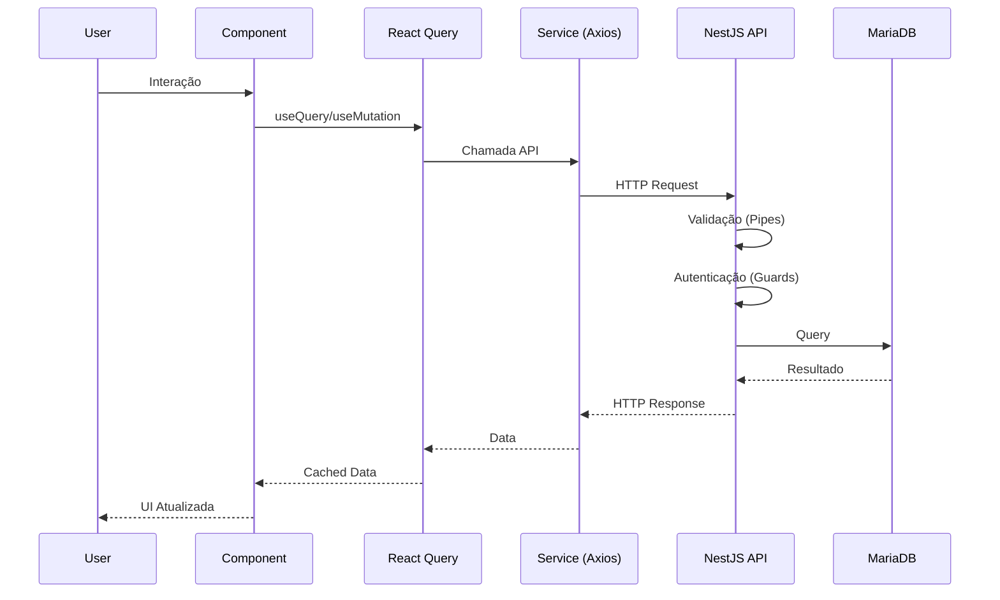

# Visão Geral da Arquitetura

## 1. Introdução

Este documento descreve a arquitetura de referência para aplicações web modernas utilizando
um monorepo gerenciado por Turborepo, com frontend Next.js e backend NestJS.

### 1.1 Propósito

Esta arquitetura foi projetada para:

- **Escalabilidade**: Suportar crescimento horizontal e vertical
- **Manutenibilidade**: Código organizado e fácil de manter
- **Performance**: Otimizações em tempo de build e runtime
- **Developer Experience**: Ambiente de desenvolvimento produtivo
- **Segurança**: Implementação de boas práticas de segurança

### 1.2 Escopo

Aplicável a projetos que necessitam de:

- Interface web moderna e responsiva
- API RESTful robusta
- Autenticação e autorização
- Persistência de dados relacional
- Deploy containerizado

---

## 2. Stack Tecnológico

### 2.1 Visão Geral das Tecnologias

```
┌─────────────────────────────────────────────────────────────────┐
│                        MONOREPO (Turborepo 2.0)                 │
├─────────────────────────────────────────────────────────────────┤
│  ┌────────────────────────┐    ┌────────────────────────────┐  │
│  │      FRONTEND          │    │         BACKEND            │  │
│  │    (apps/web)          │    │        (apps/api)          │  │
│  ├────────────────────────┤    ├────────────────────────────┤  │
│  │ • Next.js 14.x         │    │ • NestJS 10.x + Fastify    │  │
│  │ • React 18.x           │    │ • TypeORM 0.3.x            │  │
│  │ • shadcn/ui + Tailwind │    │ • Passport + JWT           │  │
│  │ • Radix UI primitives  │    │ • Class Validator          │  │
│  │ • Zustand 4.x          │    │ • Swagger/OpenAPI          │  │
│  │ • TanStack Query 5.x   │    │ • Amazon SES               │  │
│  │ • Axios 1.x            │    │ • @fastify/helmet          │  │
│  └────────────────────────┘    └────────────────────────────┘  │
│                                                                 │
│  ┌────────────────────────────────────────────────────────────┐│
│  │                    PACKAGES (packages/)                     ││
│  │  • @repo/ui          - Componentes compartilhados           ││
│  │  • @repo/config      - Configurações (ESLint, TS, etc.)     ││
│  │  • @repo/types       - Tipos TypeScript compartilhados      ││
│  │  • @repo/utils       - Utilitários compartilhados           ││
│  └────────────────────────────────────────────────────────────┘│
└─────────────────────────────────────────────────────────────────┘
                                │
                                ▼
┌─────────────────────────────────────────────────────────────────┐
│                    INFRAESTRUTURA (Docker)                      │
├─────────────────────────────────────────────────────────────────┤
│  ┌──────────────┐  ┌──────────────┐  ┌──────────────────────┐  │
│  │   MariaDB    │  │    Redis     │  │   Nginx (opcional)   │  │
│  │    10.11     │  │   (cache)    │  │    (reverse proxy)   │  │
│  └──────────────┘  └──────────────┘  └──────────────────────┘  │
└─────────────────────────────────────────────────────────────────┘
```

### 2.2 Justificativa das Escolhas

| Tecnologia          | Justificativa                                               |
|---------------------|-------------------------------------------------------------|
| **Turborepo**       | Build system otimizado, cache inteligente, paralelização    |
| **Next.js**         | SSR/SSG, App Router, otimização automática, DX excelente    |
| **React**           | Ecossistema maduro, comunidade ativa, componentização       |
| **shadcn/ui**       | Componentes acessíveis, customizáveis, código-fonte próprio |
| **TailwindCSS**     | Utility-first, produtividade, bundle otimizado              |
| **Radix UI**        | Primitivos acessíveis, headless, WAI-ARIA compliant         |
| **Zustand**         | Estado global simples, performático, sem boilerplate        |
| **TanStack Query**  | Cache de servidor, sincronização, mutações otimistas        |
| **NestJS + Fastify**| Arquitetura modular, Fastify 2x mais rápido que Express     |
| **TypeORM**         | ORM maduro, migrations, suporte TypeScript nativo           |
| **MariaDB**         | MySQL-compatible, performance, open-source                  |
| **Amazon SES**      | Alta entregabilidade, custo-benefício, escalável            |
| **Docker**          | Portabilidade, isolamento, deploy consistente               |

---

## 3. Estrutura do Monorepo

### 3.1 Organização de Diretórios

```
project-root/
├── apps/
│   ├── web/                          # Frontend Next.js
│   │   ├── src/
│   │   │   ├── app/                  # App Router (páginas)
│   │   │   ├── components/           # Componentes React
│   │   │   ├── hooks/                # Custom hooks
│   │   │   ├── services/             # Serviços (API calls)
│   │   │   ├── stores/               # Zustand stores
│   │   │   ├── types/                # Tipos locais
│   │   │   └── utils/                # Utilitários locais
│   │   ├── public/                   # Assets estáticos
│   │   ├── next.config.js
│   │   ├── tailwind.config.js
│   │   └── package.json
│   │
│   └── api/                          # Backend NestJS
│       ├── src/
│       │   ├── modules/              # Módulos de domínio
│       │   │   ├── auth/             # Autenticação
│       │   │   ├── users/            # Usuários
│       │   │   └── [domain]/         # Outros domínios
│       │   ├── common/               # Código compartilhado
│       │   │   ├── decorators/
│       │   │   ├── filters/
│       │   │   ├── guards/
│       │   │   ├── interceptors/
│       │   │   └── pipes/
│       │   ├── config/               # Configurações
│       │   ├── database/             # Configuração DB
│       │   │   ├── migrations/
│       │   │   └── seeds/
│       │   └── main.ts
│       ├── test/                     # Testes E2E
│       └── package.json
│
├── packages/
│   ├── ui/                           # Componentes UI compartilhados
│   │   ├── src/
│   │   │   ├── components/
│   │   │   └── index.ts
│   │   └── package.json
│   │
│   ├── config/                       # Configurações compartilhadas
│   │   ├── eslint/
│   │   ├── typescript/
│   │   └── tailwind/
│   │
│   ├── types/                        # Tipos compartilhados
│   │   ├── src/
│   │   │   ├── api/                  # DTOs e interfaces da API
│   │   │   ├── entities/             # Tipos de entidades
│   │   │   └── index.ts
│   │   └── package.json
│   │
│   └── utils/                        # Utilitários compartilhados
│       ├── src/
│       │   ├── validation/
│       │   ├── formatting/
│       │   └── index.ts
│       └── package.json
│
├── docker/
│   ├── docker-compose.yml            # Orquestração local
│   ├── docker-compose.prod.yml       # Orquestração produção
│   ├── Dockerfile.web                # Build frontend
│   └── Dockerfile.api                # Build backend
│
├── .github/
│   └── workflows/                    # GitHub Actions
│       ├── ci.yml
│       └── deploy.yml
│
├── docs/                             # Documentação
│   ├── architecture/
│   └── guides/
│
├── turbo.json                        # Configuração Turborepo
├── package.json                      # Root package.json
├── pnpm-workspace.yaml               # Workspace config
└── .env.example                      # Template de variáveis
```

### 3.2 Convenções de Nomenclatura

| Tipo                    | Convenção              | Exemplo                    |
|-------------------------|------------------------|----------------------------|
| Arquivos componentes    | PascalCase             | `UserProfile.tsx`          |
| Arquivos utilitários    | camelCase              | `formatDate.ts`            |
| Pastas                  | kebab-case             | `user-profile/`            |
| Variáveis de ambiente   | SCREAMING_SNAKE_CASE   | `DATABASE_URL`             |
| Constantes              | SCREAMING_SNAKE_CASE   | `MAX_RETRY_COUNT`          |
| Funções/métodos         | camelCase              | `getUserById()`            |
| Classes                 | PascalCase             | `UserService`              |
| Interfaces              | PascalCase (I prefix)  | `IUserRepository`          |
| Types                   | PascalCase             | `UserResponse`             |
| Enums                   | PascalCase             | `UserRole`                 |

---

## 4. Padrões Arquiteturais

### 4.1 Frontend - Arquitetura de Camadas

```
┌─────────────────────────────────────────────────────────────┐
│                      PRESENTATION LAYER                      │
│  ┌─────────────────────────────────────────────────────────┐│
│  │  Pages (App Router)  │  Components  │  Layouts          ││
│  └─────────────────────────────────────────────────────────┘│
├─────────────────────────────────────────────────────────────┤
│                       APPLICATION LAYER                      │
│  ┌─────────────────────────────────────────────────────────┐│
│  │  Hooks    │    Stores (Zustand)    │    Providers       ││
│  └─────────────────────────────────────────────────────────┘│
├─────────────────────────────────────────────────────────────┤
│                         DATA LAYER                           │
│  ┌─────────────────────────────────────────────────────────┐│
│  │  Services (Axios)  │  React Query  │  API Clients       ││
│  └─────────────────────────────────────────────────────────┘│
└─────────────────────────────────────────────────────────────┘
```

### 4.2 Backend - Clean Architecture

```
┌─────────────────────────────────────────────────────────────┐
│                       PRESENTATION LAYER                     │
│  ┌─────────────────────────────────────────────────────────┐│
│  │  Controllers  │  DTOs  │  Validators  │  Decorators     ││
│  └─────────────────────────────────────────────────────────┘│
├─────────────────────────────────────────────────────────────┤
│                       APPLICATION LAYER                      │
│  ┌─────────────────────────────────────────────────────────┐│
│  │  Services  │  Use Cases  │  Guards  │  Interceptors     ││
│  └─────────────────────────────────────────────────────────┘│
├─────────────────────────────────────────────────────────────┤
│                         DOMAIN LAYER                         │
│  ┌─────────────────────────────────────────────────────────┐│
│  │  Entities  │  Value Objects  │  Domain Services         ││
│  └─────────────────────────────────────────────────────────┘│
├─────────────────────────────────────────────────────────────┤
│                      INFRASTRUCTURE LAYER                    │
│  ┌─────────────────────────────────────────────────────────┐│
│  │  Repositories  │  External APIs  │  Database  │  Cache  ││
│  └─────────────────────────────────────────────────────────┘│
└─────────────────────────────────────────────────────────────┘
```

---

## 5. Fluxo de Dados

### 5.1 Request Flow (Frontend → Backend)



### 5.2 Estado da Aplicação

```
┌──────────────────────────────────────────────────────────────┐
│                    GERENCIAMENTO DE ESTADO                    │
├──────────────────────────────────────────────────────────────┤
│                                                              │
│  ┌─────────────────┐        ┌─────────────────────────────┐ │
│  │    ZUSTAND      │        │      TANSTACK QUERY         │ │
│  │  (Client State) │        │      (Server State)         │ │
│  ├─────────────────┤        ├─────────────────────────────┤ │
│  │ • UI State      │        │ • Dados da API              │ │
│  │ • Preferências  │        │ • Cache automático          │ │
│  │ • Tema          │        │ • Sincronização             │ │
│  │ • Sidebar       │        │ • Background refetch        │ │
│  │ • Modais        │        │ • Optimistic updates        │ │
│  └─────────────────┘        └─────────────────────────────┘ │
│                                                              │
│  ┌──────────────────────────────────────────────────────┐   │
│  │              LOCAL STATE (useState/useReducer)        │   │
│  │  • Estado de formulários                              │   │
│  │  • Estado de componentes isolados                     │   │
│  │  • Animações e transições                             │   │
│  └──────────────────────────────────────────────────────┘   │
│                                                              │
└──────────────────────────────────────────────────────────────┘
```

---

## 6. Princípios de Design

### 6.1 SOLID

| Princípio                     | Aplicação                                        |
|-------------------------------|--------------------------------------------------|
| **S**ingle Responsibility     | Um módulo/classe = uma responsabilidade          |
| **O**pen/Closed               | Extensível sem modificação do código existente   |
| **L**iskov Substitution       | Subtipos substituíveis por tipos base            |
| **I**nterface Segregation     | Interfaces específicas ao invés de genéricas     |
| **D**ependency Inversion      | Depender de abstrações, não implementações       |

### 6.2 Outros Princípios

- **DRY** (Don't Repeat Yourself): Código compartilhado em packages
- **KISS** (Keep It Simple): Soluções simples primeiro
- **YAGNI** (You Aren't Gonna Need It): Não adicionar funcionalidades desnecessárias
- **Separation of Concerns**: Camadas bem definidas

---

## 7. Comunicação Entre Serviços

### 7.1 API REST

- **Versionamento**: `/api/v1/`
- **Padrão de resposta**: JSON padronizado
- **Códigos HTTP**: Uso correto (200, 201, 400, 401, 403, 404, 500)
- **Paginação**: Cursor-based ou offset-based

### 7.2 Formato de Resposta Padrão

```typescript
// Sucesso
{
  "success": true,
  "data": { ... },
  "meta": {
    "page": 1,
    "limit": 10,
    "total": 100
  }
}

// Erro
{
  "success": false,
  "error": {
    "code": "VALIDATION_ERROR",
    "message": "Dados inválidos",
    "details": [
      { "field": "email", "message": "Email inválido" }
    ]
  }
}
```

---

## 8. Próximos Documentos

- [Frontend (Next.js)](./02-FRONTEND.md) - Detalhes da arquitetura frontend
- [Backend (NestJS)](./03-BACKEND.md) - Detalhes da arquitetura backend
- [Banco de Dados](./04-BANCO-DE-DADOS.md) - Modelagem e ORM
- [Autenticação](./05-AUTENTICACAO.md) - Fluxo JWT + Passport
- [Infraestrutura](./06-INFRAESTRUTURA.md) - Docker e deploy

---

## Histórico de Revisões

| Data       | Versão | Autor        | Descrição              |
|------------|--------|--------------|------------------------|
| 2026-02-11 | 1.0.0  | Arquiteto    | Versão inicial         |
