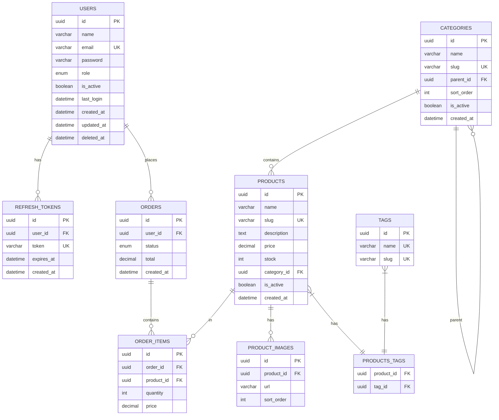

# Arquitetura de Banco de Dados

## 1. Visão Geral

O sistema utiliza **MariaDB 10.11** como banco de dados relacional, acessado através
do **TypeORM 0.3.x** como ORM (Object-Relational Mapping).

### 1.1 Características do MariaDB

- **Compatibilidade MySQL**: 100% compatível com MySQL
- **Performance**: Otimizado para leitura/escrita intensiva
- **Open Source**: Licença GPL, sem custos de licenciamento
- **Replicação**: Suporte nativo a replicação master-slave
- **Storage Engines**: InnoDB (padrão), Aria, MyRocks

### 1.2 Características do TypeORM

- **TypeScript First**: Tipagem forte e autocompletion
- **Active Record & Data Mapper**: Suporte a ambos padrões
- **Migrations**: Sistema de versionamento de schema
- **Relations**: Suporte completo a relacionamentos
- **Query Builder**: Construção de queries fluente

---

## 2. Configuração do TypeORM

### 2.1 Módulo de Database

```typescript
// database/database.module.ts
import { Module } from '@nestjs/common';
import { TypeOrmModule } from '@nestjs/typeorm';
import { ConfigModule, ConfigService } from '@nestjs/config';

@Module({
  imports: [
    TypeOrmModule.forRootAsync({
      imports: [ConfigModule],
      inject: [ConfigService],
      useFactory: (configService: ConfigService) => ({
        type: 'mariadb',
        host: configService.get('database.host'),
        port: configService.get('database.port'),
        username: configService.get('database.username'),
        password: configService.get('database.password'),
        database: configService.get('database.name'),

        // Entidades
        entities: [__dirname + '/../**/*.entity{.ts,.js}'],

        // Migrations
        migrations: [__dirname + '/migrations/*{.ts,.js}'],
        migrationsRun: false, // Executar via CLI

        // Sincronização (APENAS desenvolvimento)
        synchronize: configService.get('NODE_ENV') === 'development',

        // Logging
        logging: configService.get('NODE_ENV') === 'development',
        logger: 'advanced-console',

        // Pool de conexões
        extra: {
          connectionLimit: 10,
        },

        // Timezone
        timezone: '-03:00', // Brasília
      }),
    }),
  ],
})
export class DatabaseModule {}
```

### 2.2 Data Source (CLI e Migrations)

```typescript
// database/data-source.ts
import { DataSource, DataSourceOptions } from 'typeorm';
import { config } from 'dotenv';

config({ path: '.env.local' });

export const dataSourceOptions: DataSourceOptions = {
  type: 'mariadb',
  host: process.env.DB_HOST || 'localhost',
  port: parseInt(process.env.DB_PORT || '3306'),
  username: process.env.DB_USERNAME || 'root',
  password: process.env.DB_PASSWORD || '',
  database: process.env.DB_NAME || 'app_db',
  entities: ['src/**/*.entity.ts'],
  migrations: ['src/database/migrations/*.ts'],
  synchronize: false,
};

const dataSource = new DataSource(dataSourceOptions);
export default dataSource;
```

### 2.3 Scripts de Migration (package.json)

```json
{
  "scripts": {
    "typeorm": "ts-node -r tsconfig-paths/register ./node_modules/typeorm/cli.js",
    "migration:generate": "npm run typeorm -- migration:generate src/database/migrations/$npm_config_name -d src/database/data-source.ts",
    "migration:create": "npm run typeorm -- migration:create src/database/migrations/$npm_config_name",
    "migration:run": "npm run typeorm -- migration:run -d src/database/data-source.ts",
    "migration:revert": "npm run typeorm -- migration:revert -d src/database/data-source.ts",
    "migration:show": "npm run typeorm -- migration:show -d src/database/data-source.ts"
  }
}
```

---

## 3. Modelagem de Entidades

### 3.1 Entidade Base

```typescript
// database/entities/base.entity.ts
import {
  PrimaryGeneratedColumn,
  CreateDateColumn,
  UpdateDateColumn,
  DeleteDateColumn,
} from 'typeorm';

export abstract class BaseEntity {
  @PrimaryGeneratedColumn('uuid')
  id: string;

  @CreateDateColumn({ name: 'created_at' })
  createdAt: Date;

  @UpdateDateColumn({ name: 'updated_at' })
  updatedAt: Date;

  @DeleteDateColumn({ name: 'deleted_at' })
  deletedAt: Date;
}
```

### 3.2 Entidade de Usuário

```typescript
// modules/users/entities/user.entity.ts
import {
  Entity,
  Column,
  Index,
  OneToMany,
  BeforeInsert,
  BeforeUpdate,
} from 'typeorm';
import { Exclude } from 'class-transformer';
import { BaseEntity } from '@/database/entities/base.entity';
import { UserRole } from '../enums/user-role.enum';
import { RefreshToken } from '@/modules/auth/entities/refresh-token.entity';

@Entity('users')
export class User extends BaseEntity {
  @Column({ length: 100 })
  name: string;

  @Column({ unique: true, length: 255 })
  @Index('idx_users_email')
  email: string;

  @Column({ length: 255 })
  @Exclude()
  password: string;

  @Column({
    type: 'enum',
    enum: UserRole,
    default: UserRole.USER,
  })
  role: UserRole;

  @Column({ name: 'is_active', default: true })
  isActive: boolean;

  @Column({ name: 'avatar_url', nullable: true, length: 500 })
  avatarUrl: string;

  @Column({ name: 'phone', nullable: true, length: 20 })
  phone: string;

  @Column({ name: 'last_login', type: 'datetime', nullable: true })
  lastLogin: Date;

  @Column({ name: 'failed_login_attempts', default: 0 })
  failedLoginAttempts: number;

  @Column({ name: 'locked_until', type: 'datetime', nullable: true })
  lockedUntil: Date;

  // ============================================
  // RELACIONAMENTOS
  // ============================================

  @OneToMany(() => RefreshToken, (token) => token.user)
  refreshTokens: RefreshToken[];

  // ============================================
  // HOOKS
  // ============================================

  @BeforeInsert()
  @BeforeUpdate()
  normalizeEmail() {
    if (this.email) {
      this.email = this.email.toLowerCase().trim();
    }
  }
}
```

### 3.3 Exemplo: Entidade com Relacionamentos

```typescript
// modules/products/entities/product.entity.ts
import {
  Entity,
  Column,
  ManyToOne,
  OneToMany,
  ManyToMany,
  JoinTable,
  JoinColumn,
  Index,
} from 'typeorm';
import { BaseEntity } from '@/database/entities/base.entity';
import { Category } from './category.entity';
import { ProductImage } from './product-image.entity';
import { Tag } from './tag.entity';

@Entity('products')
export class Product extends BaseEntity {
  @Column({ length: 200 })
  name: string;

  @Column({ unique: true, length: 100 })
  @Index('idx_products_slug')
  slug: string;

  @Column({ type: 'text', nullable: true })
  description: string;

  @Column({ type: 'decimal', precision: 10, scale: 2 })
  price: number;

  @Column({ name: 'compare_at_price', type: 'decimal', precision: 10, scale: 2, nullable: true })
  compareAtPrice: number;

  @Column({ name: 'cost_price', type: 'decimal', precision: 10, scale: 2, nullable: true })
  costPrice: number;

  @Column({ default: 0 })
  stock: number;

  @Column({ length: 50, nullable: true })
  sku: string;

  @Column({ name: 'is_active', default: true })
  isActive: boolean;

  @Column({ name: 'is_featured', default: false })
  isFeatured: boolean;

  // ============================================
  // RELACIONAMENTOS
  // ============================================

  // Many-to-One: Produto pertence a uma Categoria
  @ManyToOne(() => Category, (category) => category.products, {
    nullable: false,
    onDelete: 'RESTRICT',
  })
  @JoinColumn({ name: 'category_id' })
  category: Category;

  @Column({ name: 'category_id' })
  categoryId: string;

  // One-to-Many: Produto tem muitas Imagens
  @OneToMany(() => ProductImage, (image) => image.product, {
    cascade: true,
    eager: true,
  })
  images: ProductImage[];

  // Many-to-Many: Produto tem muitas Tags
  @ManyToMany(() => Tag, (tag) => tag.products)
  @JoinTable({
    name: 'products_tags',
    joinColumn: { name: 'product_id', referencedColumnName: 'id' },
    inverseJoinColumn: { name: 'tag_id', referencedColumnName: 'id' },
  })
  tags: Tag[];
}
```

### 3.4 Entidade de Categoria

```typescript
// modules/products/entities/category.entity.ts
import {
  Entity,
  Column,
  ManyToOne,
  OneToMany,
  JoinColumn,
  Tree,
  TreeParent,
  TreeChildren,
} from 'typeorm';
import { BaseEntity } from '@/database/entities/base.entity';
import { Product } from './product.entity';

@Entity('categories')
@Tree('materialized-path') // Estrutura hierárquica
export class Category extends BaseEntity {
  @Column({ length: 100 })
  name: string;

  @Column({ unique: true, length: 100 })
  slug: string;

  @Column({ type: 'text', nullable: true })
  description: string;

  @Column({ name: 'image_url', nullable: true, length: 500 })
  imageUrl: string;

  @Column({ name: 'is_active', default: true })
  isActive: boolean;

  @Column({ name: 'sort_order', default: 0 })
  sortOrder: number;

  // Estrutura de árvore
  @TreeParent()
  @ManyToOne(() => Category, (category) => category.children)
  @JoinColumn({ name: 'parent_id' })
  parent: Category;

  @TreeChildren()
  @OneToMany(() => Category, (category) => category.parent)
  children: Category[];

  // Produtos da categoria
  @OneToMany(() => Product, (product) => product.category)
  products: Product[];
}
```

---

## 4. Migrations

### 4.1 Exemplo de Migration

```typescript
// database/migrations/1707660000000-CreateUsersTable.ts
import { MigrationInterface, QueryRunner, Table, Index } from 'typeorm';

export class CreateUsersTable1707660000000 implements MigrationInterface {
  name = 'CreateUsersTable1707660000000';

  public async up(queryRunner: QueryRunner): Promise<void> {
    await queryRunner.createTable(
      new Table({
        name: 'users',
        columns: [
          {
            name: 'id',
            type: 'varchar',
            length: '36',
            isPrimary: true,
            isGenerated: true,
            generationStrategy: 'uuid',
          },
          {
            name: 'name',
            type: 'varchar',
            length: '100',
          },
          {
            name: 'email',
            type: 'varchar',
            length: '255',
            isUnique: true,
          },
          {
            name: 'password',
            type: 'varchar',
            length: '255',
          },
          {
            name: 'role',
            type: 'enum',
            enum: ['admin', 'manager', 'user'],
            default: "'user'",
          },
          {
            name: 'is_active',
            type: 'boolean',
            default: true,
          },
          {
            name: 'avatar_url',
            type: 'varchar',
            length: '500',
            isNullable: true,
          },
          {
            name: 'phone',
            type: 'varchar',
            length: '20',
            isNullable: true,
          },
          {
            name: 'last_login',
            type: 'datetime',
            isNullable: true,
          },
          {
            name: 'failed_login_attempts',
            type: 'int',
            default: 0,
          },
          {
            name: 'locked_until',
            type: 'datetime',
            isNullable: true,
          },
          {
            name: 'created_at',
            type: 'datetime',
            default: 'CURRENT_TIMESTAMP',
          },
          {
            name: 'updated_at',
            type: 'datetime',
            default: 'CURRENT_TIMESTAMP',
            onUpdate: 'CURRENT_TIMESTAMP',
          },
          {
            name: 'deleted_at',
            type: 'datetime',
            isNullable: true,
          },
        ],
      }),
      true,
    );

    // Índices
    await queryRunner.createIndex(
      'users',
      new Index({
        name: 'idx_users_email',
        columnNames: ['email'],
      }),
    );

    await queryRunner.createIndex(
      'users',
      new Index({
        name: 'idx_users_role',
        columnNames: ['role'],
      }),
    );
  }

  public async down(queryRunner: QueryRunner): Promise<void> {
    await queryRunner.dropIndex('users', 'idx_users_role');
    await queryRunner.dropIndex('users', 'idx_users_email');
    await queryRunner.dropTable('users');
  }
}
```

### 4.2 Migration com Foreign Keys

```typescript
// database/migrations/1707660100000-CreateProductsTable.ts
import { MigrationInterface, QueryRunner, Table, TableForeignKey } from 'typeorm';

export class CreateProductsTable1707660100000 implements MigrationInterface {
  public async up(queryRunner: QueryRunner): Promise<void> {
    // Tabela de categorias
    await queryRunner.createTable(
      new Table({
        name: 'categories',
        columns: [
          { name: 'id', type: 'varchar', length: '36', isPrimary: true },
          { name: 'name', type: 'varchar', length: '100' },
          { name: 'slug', type: 'varchar', length: '100', isUnique: true },
          { name: 'parent_id', type: 'varchar', length: '36', isNullable: true },
          { name: 'created_at', type: 'datetime', default: 'CURRENT_TIMESTAMP' },
          { name: 'updated_at', type: 'datetime', default: 'CURRENT_TIMESTAMP' },
          { name: 'deleted_at', type: 'datetime', isNullable: true },
        ],
      }),
    );

    // Tabela de produtos
    await queryRunner.createTable(
      new Table({
        name: 'products',
        columns: [
          { name: 'id', type: 'varchar', length: '36', isPrimary: true },
          { name: 'name', type: 'varchar', length: '200' },
          { name: 'slug', type: 'varchar', length: '100', isUnique: true },
          { name: 'description', type: 'text', isNullable: true },
          { name: 'price', type: 'decimal', precision: 10, scale: 2 },
          { name: 'stock', type: 'int', default: 0 },
          { name: 'category_id', type: 'varchar', length: '36' },
          { name: 'is_active', type: 'boolean', default: true },
          { name: 'created_at', type: 'datetime', default: 'CURRENT_TIMESTAMP' },
          { name: 'updated_at', type: 'datetime', default: 'CURRENT_TIMESTAMP' },
          { name: 'deleted_at', type: 'datetime', isNullable: true },
        ],
      }),
    );

    // Foreign Key: produtos -> categorias
    await queryRunner.createForeignKey(
      'products',
      new TableForeignKey({
        name: 'fk_products_category',
        columnNames: ['category_id'],
        referencedTableName: 'categories',
        referencedColumnNames: ['id'],
        onDelete: 'RESTRICT',
        onUpdate: 'CASCADE',
      }),
    );

    // Self-referencing FK: categorias -> categorias (parent)
    await queryRunner.createForeignKey(
      'categories',
      new TableForeignKey({
        name: 'fk_categories_parent',
        columnNames: ['parent_id'],
        referencedTableName: 'categories',
        referencedColumnNames: ['id'],
        onDelete: 'SET NULL',
        onUpdate: 'CASCADE',
      }),
    );
  }

  public async down(queryRunner: QueryRunner): Promise<void> {
    await queryRunner.dropForeignKey('products', 'fk_products_category');
    await queryRunner.dropForeignKey('categories', 'fk_categories_parent');
    await queryRunner.dropTable('products');
    await queryRunner.dropTable('categories');
  }
}
```

---

## 5. Repository Pattern

### 5.1 Custom Repository

```typescript
// modules/users/users.repository.ts
import { Injectable } from '@nestjs/common';
import { DataSource, Repository, FindOptionsWhere, Like } from 'typeorm';
import { User } from './entities/user.entity';
import { PaginationDto } from '@/common/dto/pagination.dto';

@Injectable()
export class UsersRepository extends Repository<User> {
  constructor(private dataSource: DataSource) {
    super(User, dataSource.createEntityManager());
  }

  /**
   * Busca usuários com paginação e filtros
   */
  async findAllPaginated(
    pagination: PaginationDto,
  ): Promise<{ data: User[]; total: number }> {
    const { page = 1, limit = 10, search } = pagination;
    const skip = (page - 1) * limit;

    const queryBuilder = this.createQueryBuilder('user')
      .select([
        'user.id',
        'user.name',
        'user.email',
        'user.role',
        'user.isActive',
        'user.createdAt',
      ])
      .where('user.deletedAt IS NULL');

    // Filtro de busca
    if (search) {
      queryBuilder.andWhere(
        '(user.name LIKE :search OR user.email LIKE :search)',
        { search: `%${search}%` },
      );
    }

    // Ordenação e paginação
    queryBuilder
      .orderBy('user.createdAt', 'DESC')
      .skip(skip)
      .take(limit);

    const [data, total] = await queryBuilder.getManyAndCount();

    return { data, total };
  }

  /**
   * Busca usuário com tokens de refresh
   */
  async findByIdWithTokens(id: string): Promise<User | null> {
    return this.createQueryBuilder('user')
      .leftJoinAndSelect('user.refreshTokens', 'token')
      .where('user.id = :id', { id })
      .andWhere('token.expiresAt > :now', { now: new Date() })
      .getOne();
  }

  /**
   * Atualiza último login
   */
  async updateLastLogin(id: string): Promise<void> {
    await this.update(id, {
      lastLogin: new Date(),
      failedLoginAttempts: 0,
      lockedUntil: null,
    });
  }

  /**
   * Incrementa tentativas de login falhas
   */
  async incrementFailedAttempts(id: string): Promise<User> {
    const user = await this.findOneBy({ id });

    if (user) {
      user.failedLoginAttempts += 1;

      // Bloqueia após 5 tentativas
      if (user.failedLoginAttempts >= 5) {
        user.lockedUntil = new Date(Date.now() + 30 * 60 * 1000); // 30 min
      }

      await this.save(user);
    }

    return user;
  }

  /**
   * Busca usuários ativos por role
   */
  async findActiveByRole(role: string): Promise<User[]> {
    return this.find({
      where: {
        role: role as any,
        isActive: true,
        deletedAt: null,
      },
      order: { name: 'ASC' },
    });
  }
}
```

### 5.2 Usando o Repository no Service

```typescript
// modules/users/users.service.ts
import { Injectable, NotFoundException } from '@nestjs/common';
import { UsersRepository } from './users.repository';
import { User } from './entities/user.entity';

@Injectable()
export class UsersService {
  constructor(private readonly usersRepository: UsersRepository) {}

  async findAll(pagination: PaginationDto) {
    const { data, total } = await this.usersRepository.findAllPaginated(pagination);

    return {
      data,
      meta: {
        page: pagination.page,
        limit: pagination.limit,
        total,
        totalPages: Math.ceil(total / pagination.limit),
      },
    };
  }

  async findOne(id: string): Promise<User> {
    const user = await this.usersRepository.findOne({
      where: { id },
    });

    if (!user) {
      throw new NotFoundException(`Usuário #${id} não encontrado`);
    }

    return user;
  }
}
```

---

## 6. Query Builder Avançado

### 6.1 Queries Complexas

```typescript
// Exemplo: Relatório de vendas por período
async getSalesReport(startDate: Date, endDate: Date) {
  return this.createQueryBuilder('order')
    .select([
      'DATE(order.createdAt) as date',
      'COUNT(order.id) as totalOrders',
      'SUM(order.total) as totalRevenue',
      'AVG(order.total) as averageOrder',
    ])
    .innerJoin('order.items', 'item')
    .innerJoin('item.product', 'product')
    .addSelect('product.category_id', 'categoryId')
    .where('order.createdAt BETWEEN :startDate AND :endDate', {
      startDate,
      endDate,
    })
    .andWhere('order.status = :status', { status: 'completed' })
    .groupBy('DATE(order.createdAt)')
    .addGroupBy('product.category_id')
    .orderBy('date', 'DESC')
    .getRawMany();
}

// Exemplo: Busca com múltiplos joins
async getProductWithDetails(id: string) {
  return this.createQueryBuilder('product')
    .leftJoinAndSelect('product.category', 'category')
    .leftJoinAndSelect('product.images', 'images')
    .leftJoinAndSelect('product.tags', 'tags')
    .leftJoin('product.reviews', 'reviews')
    .addSelect('AVG(reviews.rating)', 'averageRating')
    .addSelect('COUNT(reviews.id)', 'reviewCount')
    .where('product.id = :id', { id })
    .groupBy('product.id')
    .getOne();
}

// Exemplo: Subquery
async getUsersWithOrderCount() {
  const subQuery = this.ordersRepository
    .createQueryBuilder('order')
    .select('COUNT(order.id)')
    .where('order.user_id = user.id');

  return this.createQueryBuilder('user')
    .select(['user.id', 'user.name', 'user.email'])
    .addSelect(`(${subQuery.getQuery()})`, 'orderCount')
    .orderBy('orderCount', 'DESC')
    .getRawMany();
}
```

### 6.2 Transactions

```typescript
// Exemplo: Criação de pedido com transaction
async createOrder(createOrderDto: CreateOrderDto, userId: string) {
  const queryRunner = this.dataSource.createQueryRunner();

  await queryRunner.connect();
  await queryRunner.startTransaction();

  try {
    // 1. Criar pedido
    const order = queryRunner.manager.create(Order, {
      userId,
      status: 'pending',
      total: 0,
    });
    await queryRunner.manager.save(order);

    // 2. Criar itens e calcular total
    let total = 0;
    for (const item of createOrderDto.items) {
      const product = await queryRunner.manager.findOne(Product, {
        where: { id: item.productId },
        lock: { mode: 'pessimistic_write' }, // Lock para evitar race condition
      });

      if (!product || product.stock < item.quantity) {
        throw new BadRequestException('Estoque insuficiente');
      }

      // Criar item do pedido
      const orderItem = queryRunner.manager.create(OrderItem, {
        orderId: order.id,
        productId: product.id,
        quantity: item.quantity,
        price: product.price,
      });
      await queryRunner.manager.save(orderItem);

      // Atualizar estoque
      product.stock -= item.quantity;
      await queryRunner.manager.save(product);

      total += product.price * item.quantity;
    }

    // 3. Atualizar total do pedido
    order.total = total;
    await queryRunner.manager.save(order);

    // Commit
    await queryRunner.commitTransaction();

    return order;
  } catch (error) {
    // Rollback em caso de erro
    await queryRunner.rollbackTransaction();
    throw error;
  } finally {
    // Liberar queryRunner
    await queryRunner.release();
  }
}
```

---

## 7. Seeds (Dados Iniciais)

### 7.1 Seeder de Usuários

```typescript
// database/seeds/user.seed.ts
import { DataSource } from 'typeorm';
import * as bcrypt from 'bcrypt';
import { User } from '@/modules/users/entities/user.entity';
import { UserRole } from '@/modules/users/enums/user-role.enum';

export async function seedUsers(dataSource: DataSource) {
  const userRepository = dataSource.getRepository(User);

  // Verifica se já existe admin
  const existingAdmin = await userRepository.findOne({
    where: { email: 'admin@sistema.com' },
  });

  if (existingAdmin) {
    console.log('Admin já existe, pulando seed...');
    return;
  }

  const hashedPassword = await bcrypt.hash('Admin@123', 10);

  const users = [
    {
      name: 'Administrador',
      email: 'admin@sistema.com',
      password: hashedPassword,
      role: UserRole.ADMIN,
      isActive: true,
    },
    {
      name: 'Gerente',
      email: 'gerente@sistema.com',
      password: hashedPassword,
      role: UserRole.MANAGER,
      isActive: true,
    },
    {
      name: 'Usuário Teste',
      email: 'usuario@sistema.com',
      password: hashedPassword,
      role: UserRole.USER,
      isActive: true,
    },
  ];

  for (const userData of users) {
    const user = userRepository.create(userData);
    await userRepository.save(user);
    console.log(`Usuário criado: ${user.email}`);
  }
}
```

### 7.2 Runner de Seeds

```typescript
// database/seeds/index.ts
import { DataSource } from 'typeorm';
import { dataSourceOptions } from '../data-source';
import { seedUsers } from './user.seed';

async function runSeeds() {
  const dataSource = new DataSource(dataSourceOptions);

  try {
    await dataSource.initialize();
    console.log('Conexão estabelecida');

    await seedUsers(dataSource);

    console.log('Seeds executados com sucesso!');
  } catch (error) {
    console.error('Erro ao executar seeds:', error);
    process.exit(1);
  } finally {
    await dataSource.destroy();
  }
}

runSeeds();
```

---

## 8. Diagrama de Entidades



---

## 9. Boas Práticas

### 9.1 Checklist

- [ ] Usar migrations para todas as alterações de schema
- [ ] Nunca usar `synchronize: true` em produção
- [ ] Criar índices para colunas frequentemente buscadas
- [ ] Usar soft delete para dados importantes
- [ ] Implementar paginação em listagens
- [ ] Usar transactions para operações múltiplas
- [ ] Evitar N+1 queries com eager loading ou joins
- [ ] Manter entidades coesas e bem definidas

### 9.2 Convenções de Nomenclatura

| Tipo            | Convenção         | Exemplo              |
|-----------------|-------------------|----------------------|
| Tabelas         | snake_case plural | `users`, `order_items` |
| Colunas         | snake_case        | `created_at`, `user_id` |
| Foreign Keys    | fk_tabela_ref     | `fk_orders_user`     |
| Índices         | idx_tabela_coluna | `idx_users_email`    |
| Primary Keys    | id (uuid)         | `id`                 |

---

## Próximos Documentos

- [Autenticação](./05-AUTENTICACAO.md) - JWT + Passport
- [Infraestrutura](./06-INFRAESTRUTURA.md) - Docker e deploy

---

## Histórico de Revisões

| Data       | Versão | Autor        | Descrição              |
|------------|--------|--------------|------------------------|
| 2026-02-11 | 1.0.0  | Arquiteto    | Versão inicial         |
