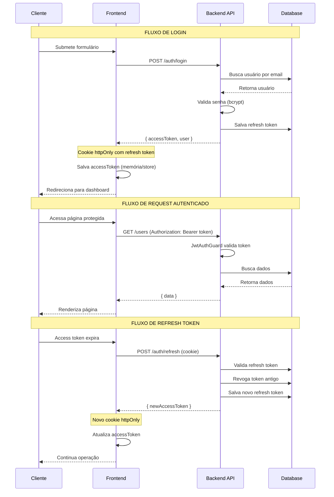

# Arquitetura de Autenticação

## 1. Visão Geral

O sistema implementa autenticação baseada em **JWT (JSON Web Tokens)** utilizando
**Passport.js** como middleware de autenticação no NestJS.

### 1.1 Estratégia de Autenticação

```
┌─────────────────────────────────────────────────────────────────────┐
│                      FLUXO DE AUTENTICAÇÃO                          │
├─────────────────────────────────────────────────────────────────────┤
│                                                                     │
│   ┌─────────┐    ┌─────────┐    ┌──────────────┐    ┌──────────┐  │
│   │ Cliente │───▶│  Login  │───▶│   Validar    │───▶│  Gerar   │  │
│   │         │    │ Request │    │  Credenciais │    │  Tokens  │  │
│   └─────────┘    └─────────┘    └──────────────┘    └──────────┘  │
│                                                            │        │
│                                                            ▼        │
│                                               ┌────────────────────┐│
│                                               │   Access Token     ││
│                                               │   (15 min)         ││
│                                               │                    ││
│                                               │   Refresh Token    ││
│                                               │   (7 dias)         ││
│                                               └────────────────────┘│
│                                                                     │
│   ┌─────────┐    ┌─────────┐    ┌──────────────┐    ┌──────────┐  │
│   │ Request │───▶│  JWT    │───▶│   Validar    │───▶│ Acesso   │  │
│   │ + Token │    │ Guard   │    │    Token     │    │ Permitido│  │
│   └─────────┘    └─────────┘    └──────────────┘    └──────────┘  │
│                                                                     │
└─────────────────────────────────────────────────────────────────────┘
```

### 1.2 Componentes

| Componente       | Responsabilidade                            |
|------------------|---------------------------------------------|
| Access Token     | Autenticação de curta duração (15 min)      |
| Refresh Token    | Renovação do access token (7 dias)          |
| JWT Strategy     | Validação do token JWT                      |
| Local Strategy   | Validação de credenciais (email/senha)      |
| Auth Guard       | Proteção de rotas                           |
| Roles Guard      | Controle de acesso baseado em roles         |

---

## 2. Estrutura do Módulo de Auth

```
modules/auth/
├── auth.module.ts
├── auth.controller.ts
├── auth.service.ts
├── strategies/
│   ├── jwt.strategy.ts
│   ├── jwt-refresh.strategy.ts
│   └── local.strategy.ts
├── guards/
│   ├── jwt-auth.guard.ts
│   ├── jwt-refresh.guard.ts
│   ├── local-auth.guard.ts
│   └── roles.guard.ts
├── decorators/
│   ├── current-user.decorator.ts
│   ├── public.decorator.ts
│   └── roles.decorator.ts
├── entities/
│   └── refresh-token.entity.ts
└── dto/
    ├── login.dto.ts
    ├── register.dto.ts
    ├── refresh-token.dto.ts
    └── auth-response.dto.ts
```

---

## 3. Implementação

### 3.1 Auth Module

```typescript
// modules/auth/auth.module.ts
import { Module } from '@nestjs/common';
import { JwtModule } from '@nestjs/jwt';
import { PassportModule } from '@nestjs/passport';
import { ConfigModule, ConfigService } from '@nestjs/config';
import { TypeOrmModule } from '@nestjs/typeorm';

import { AuthController } from './auth.controller';
import { AuthService } from './auth.service';
import { UsersModule } from '../users/users.module';

import { JwtStrategy } from './strategies/jwt.strategy';
import { JwtRefreshStrategy } from './strategies/jwt-refresh.strategy';
import { LocalStrategy } from './strategies/local.strategy';

import { RefreshToken } from './entities/refresh-token.entity';

@Module({
  imports: [
    // Módulos de dependência
    UsersModule,
    PassportModule.register({ defaultStrategy: 'jwt' }),
    TypeOrmModule.forFeature([RefreshToken]),

    // JWT config
    JwtModule.registerAsync({
      imports: [ConfigModule],
      inject: [ConfigService],
      useFactory: (configService: ConfigService) => ({
        secret: configService.get('jwt.secret'),
        signOptions: {
          expiresIn: configService.get('jwt.expiresIn'),
        },
      }),
    }),
  ],
  controllers: [AuthController],
  providers: [
    AuthService,
    LocalStrategy,
    JwtStrategy,
    JwtRefreshStrategy,
  ],
  exports: [AuthService, JwtModule],
})
export class AuthModule {}
```

### 3.2 Auth Controller

```typescript
// modules/auth/auth.controller.ts
import {
  Controller,
  Post,
  Body,
  UseGuards,
  HttpCode,
  HttpStatus,
  Req,
  Res,
  Get,
} from '@nestjs/common';
import {
  ApiTags,
  ApiOperation,
  ApiResponse,
  ApiBearerAuth,
} from '@nestjs/swagger';
import { Request, Response } from 'express';

import { AuthService } from './auth.service';
import { LocalAuthGuard } from './guards/local-auth.guard';
import { JwtAuthGuard } from './guards/jwt-auth.guard';
import { JwtRefreshGuard } from './guards/jwt-refresh.guard';
import { Public } from './decorators/public.decorator';
import { CurrentUser } from './decorators/current-user.decorator';

import { LoginDto } from './dto/login.dto';
import { RegisterDto } from './dto/register.dto';
import { AuthResponseDto } from './dto/auth-response.dto';

@ApiTags('auth')
@Controller('auth')
export class AuthController {
  constructor(private readonly authService: AuthService) {}

  // ============================================
  // REGISTRO
  // ============================================
  @Post('register')
  @Public()
  @ApiOperation({ summary: 'Registrar novo usuário' })
  @ApiResponse({
    status: HttpStatus.CREATED,
    description: 'Usuário registrado com sucesso',
    type: AuthResponseDto,
  })
  @ApiResponse({
    status: HttpStatus.CONFLICT,
    description: 'Email já está em uso',
  })
  async register(
    @Body() registerDto: RegisterDto,
    @Res({ passthrough: true }) response: Response,
  ): Promise<AuthResponseDto> {
    const result = await this.authService.register(registerDto);

    // Define cookie httpOnly para refresh token
    this.setRefreshTokenCookie(response, result.refreshToken);

    return {
      accessToken: result.accessToken,
      user: result.user,
    };
  }

  // ============================================
  // LOGIN
  // ============================================
  @Post('login')
  @Public()
  @UseGuards(LocalAuthGuard)
  @HttpCode(HttpStatus.OK)
  @ApiOperation({ summary: 'Login com email e senha' })
  @ApiResponse({
    status: HttpStatus.OK,
    description: 'Login realizado com sucesso',
    type: AuthResponseDto,
  })
  @ApiResponse({
    status: HttpStatus.UNAUTHORIZED,
    description: 'Credenciais inválidas',
  })
  async login(
    @Body() loginDto: LoginDto,
    @CurrentUser() user: any,
    @Res({ passthrough: true }) response: Response,
  ): Promise<AuthResponseDto> {
    const result = await this.authService.login(user);

    // Define cookie httpOnly para refresh token
    this.setRefreshTokenCookie(response, result.refreshToken);

    return {
      accessToken: result.accessToken,
      user: result.user,
    };
  }

  // ============================================
  // REFRESH TOKEN
  // ============================================
  @Post('refresh')
  @Public()
  @UseGuards(JwtRefreshGuard)
  @HttpCode(HttpStatus.OK)
  @ApiOperation({ summary: 'Renovar access token' })
  @ApiResponse({
    status: HttpStatus.OK,
    description: 'Token renovado com sucesso',
  })
  @ApiResponse({
    status: HttpStatus.UNAUTHORIZED,
    description: 'Refresh token inválido ou expirado',
  })
  async refresh(
    @CurrentUser() user: any,
    @Req() request: Request,
    @Res({ passthrough: true }) response: Response,
  ) {
    const refreshToken = request.cookies?.['refresh_token'];
    const result = await this.authService.refreshTokens(user.id, refreshToken);

    this.setRefreshTokenCookie(response, result.refreshToken);

    return {
      accessToken: result.accessToken,
    };
  }

  // ============================================
  // LOGOUT
  // ============================================
  @Post('logout')
  @UseGuards(JwtAuthGuard)
  @HttpCode(HttpStatus.OK)
  @ApiBearerAuth()
  @ApiOperation({ summary: 'Logout (invalidar tokens)' })
  @ApiResponse({
    status: HttpStatus.OK,
    description: 'Logout realizado com sucesso',
  })
  async logout(
    @CurrentUser() user: any,
    @Res({ passthrough: true }) response: Response,
  ) {
    await this.authService.logout(user.id);

    // Remove cookie
    response.clearCookie('refresh_token', {
      httpOnly: true,
      secure: process.env.NODE_ENV === 'production',
      sameSite: 'strict',
    });

    return { message: 'Logout realizado com sucesso' };
  }

  // ============================================
  // PERFIL DO USUÁRIO ATUAL
  // ============================================
  @Get('me')
  @UseGuards(JwtAuthGuard)
  @ApiBearerAuth()
  @ApiOperation({ summary: 'Obter dados do usuário autenticado' })
  @ApiResponse({
    status: HttpStatus.OK,
    description: 'Dados do usuário',
  })
  async me(@CurrentUser() user: any) {
    return this.authService.getProfile(user.id);
  }

  // ============================================
  // HELPER: Definir cookie de refresh token
  // ============================================
  private setRefreshTokenCookie(response: Response, token: string) {
    const maxAge = 7 * 24 * 60 * 60 * 1000; // 7 dias

    response.cookie('refresh_token', token, {
      httpOnly: true,
      secure: process.env.NODE_ENV === 'production',
      sameSite: 'strict',
      maxAge,
      path: '/api/v1/auth',
    });
  }
}
```

### 3.3 Auth Service

```typescript
// modules/auth/auth.service.ts
import {
  Injectable,
  UnauthorizedException,
  ConflictException,
  Logger,
} from '@nestjs/common';
import { JwtService } from '@nestjs/jwt';
import { ConfigService } from '@nestjs/config';
import { InjectRepository } from '@nestjs/typeorm';
import { Repository, MoreThan } from 'typeorm';
import * as bcrypt from 'bcrypt';
import { v4 as uuidv4 } from 'uuid';

import { UsersService } from '../users/users.service';
import { User } from '../users/entities/user.entity';
import { RefreshToken } from './entities/refresh-token.entity';
import { RegisterDto } from './dto/register.dto';

@Injectable()
export class AuthService {
  private readonly logger = new Logger(AuthService.name);

  constructor(
    private readonly usersService: UsersService,
    private readonly jwtService: JwtService,
    private readonly configService: ConfigService,
    @InjectRepository(RefreshToken)
    private readonly refreshTokenRepository: Repository<RefreshToken>,
  ) {}

  // ============================================
  // VALIDAR CREDENCIAIS (usado pelo LocalStrategy)
  // ============================================
  async validateUser(email: string, password: string): Promise<User | null> {
    const user = await this.usersService.findByEmail(email);

    if (!user) {
      return null;
    }

    // Verifica se conta está bloqueada
    if (user.lockedUntil && user.lockedUntil > new Date()) {
      throw new UnauthorizedException(
        'Conta temporariamente bloqueada. Tente novamente mais tarde.',
      );
    }

    // Valida senha
    const isPasswordValid = await bcrypt.compare(password, user.password);

    if (!isPasswordValid) {
      // Incrementa tentativas falhas
      await this.usersService.incrementFailedAttempts(user.id);
      return null;
    }

    // Reseta tentativas falhas e atualiza último login
    await this.usersService.updateLastLogin(user.id);

    return user;
  }

  // ============================================
  // REGISTRO
  // ============================================
  async register(registerDto: RegisterDto) {
    // Verifica se email já existe
    const existingUser = await this.usersService.findByEmail(registerDto.email);
    if (existingUser) {
      throw new ConflictException('Email já está em uso');
    }

    // Cria usuário
    const user = await this.usersService.create({
      ...registerDto,
      password: await bcrypt.hash(registerDto.password, 10),
    });

    // Gera tokens
    const tokens = await this.generateTokens(user);

    this.logger.log(`Novo usuário registrado: ${user.email}`);

    return {
      ...tokens,
      user: this.sanitizeUser(user),
    };
  }

  // ============================================
  // LOGIN
  // ============================================
  async login(user: User) {
    const tokens = await this.generateTokens(user);

    this.logger.log(`Login realizado: ${user.email}`);

    return {
      ...tokens,
      user: this.sanitizeUser(user),
    };
  }

  // ============================================
  // REFRESH TOKENS
  // ============================================
  async refreshTokens(userId: string, refreshToken: string) {
    // Busca token no banco
    const storedToken = await this.refreshTokenRepository.findOne({
      where: {
        userId,
        token: refreshToken,
        expiresAt: MoreThan(new Date()),
      },
      relations: ['user'],
    });

    if (!storedToken) {
      throw new UnauthorizedException('Refresh token inválido ou expirado');
    }

    // Revoga token atual
    await this.refreshTokenRepository.delete(storedToken.id);

    // Gera novos tokens
    const tokens = await this.generateTokens(storedToken.user);

    this.logger.log(`Tokens renovados para usuário: ${userId}`);

    return tokens;
  }

  // ============================================
  // LOGOUT
  // ============================================
  async logout(userId: string) {
    // Remove todos os refresh tokens do usuário
    await this.refreshTokenRepository.delete({ userId });

    this.logger.log(`Logout realizado: ${userId}`);
  }

  // ============================================
  // PERFIL
  // ============================================
  async getProfile(userId: string) {
    const user = await this.usersService.findOne(userId);
    return this.sanitizeUser(user);
  }

  // ============================================
  // GERAR TOKENS
  // ============================================
  private async generateTokens(user: User) {
    const payload = {
      sub: user.id,
      email: user.email,
      role: user.role,
    };

    // Access Token (curta duração)
    const accessToken = this.jwtService.sign(payload, {
      secret: this.configService.get('jwt.secret'),
      expiresIn: this.configService.get('jwt.expiresIn', '15m'),
    });

    // Refresh Token (longa duração)
    const refreshToken = uuidv4();
    const refreshExpiresIn = this.configService.get(
      'jwt.refreshExpiresIn',
      '7d',
    );

    // Salva refresh token no banco
    const expiresAt = new Date();
    expiresAt.setDate(expiresAt.getDate() + 7); // 7 dias

    await this.refreshTokenRepository.save({
      userId: user.id,
      token: refreshToken,
      expiresAt,
    });

    return {
      accessToken,
      refreshToken,
    };
  }

  // ============================================
  // SANITIZAR USUÁRIO (remover campos sensíveis)
  // ============================================
  private sanitizeUser(user: User) {
    const { password, refreshTokens, ...sanitized } = user as any;
    return sanitized;
  }
}
```

---

## 4. Strategies (Passport)

### 4.1 Local Strategy (Login)

```typescript
// modules/auth/strategies/local.strategy.ts
import { Injectable, UnauthorizedException } from '@nestjs/common';
import { PassportStrategy } from '@nestjs/passport';
import { Strategy } from 'passport-local';
import { AuthService } from '../auth.service';

@Injectable()
export class LocalStrategy extends PassportStrategy(Strategy, 'local') {
  constructor(private authService: AuthService) {
    super({
      usernameField: 'email', // Campo do DTO usado como username
      passwordField: 'password',
    });
  }

  async validate(email: string, password: string) {
    const user = await this.authService.validateUser(email, password);

    if (!user) {
      throw new UnauthorizedException('Email ou senha inválidos');
    }

    if (!user.isActive) {
      throw new UnauthorizedException('Conta desativada');
    }

    return user;
  }
}
```

### 4.2 JWT Strategy (Requests autenticados)

```typescript
// modules/auth/strategies/jwt.strategy.ts
import { Injectable, UnauthorizedException } from '@nestjs/common';
import { PassportStrategy } from '@nestjs/passport';
import { ExtractJwt, Strategy } from 'passport-jwt';
import { ConfigService } from '@nestjs/config';
import { UsersService } from '../../users/users.service';

interface JwtPayload {
  sub: string;
  email: string;
  role: string;
  iat: number;
  exp: number;
}

@Injectable()
export class JwtStrategy extends PassportStrategy(Strategy, 'jwt') {
  constructor(
    private configService: ConfigService,
    private usersService: UsersService,
  ) {
    super({
      jwtFromRequest: ExtractJwt.fromAuthHeaderAsBearerToken(),
      ignoreExpiration: false,
      secretOrKey: configService.get('jwt.secret'),
    });
  }

  async validate(payload: JwtPayload) {
    // Busca usuário para garantir que ainda existe e está ativo
    const user = await this.usersService.findByIdMinimal(payload.sub);

    if (!user) {
      throw new UnauthorizedException('Usuário não encontrado');
    }

    if (!user.isActive) {
      throw new UnauthorizedException('Conta desativada');
    }

    // Retorna dados que estarão disponíveis em request.user
    return {
      id: payload.sub,
      email: payload.email,
      role: payload.role,
    };
  }
}
```

### 4.3 JWT Refresh Strategy

```typescript
// modules/auth/strategies/jwt-refresh.strategy.ts
import { Injectable } from '@nestjs/common';
import { PassportStrategy } from '@nestjs/passport';
import { ExtractJwt, Strategy } from 'passport-jwt';
import { ConfigService } from '@nestjs/config';
import { Request } from 'express';

@Injectable()
export class JwtRefreshStrategy extends PassportStrategy(Strategy, 'jwt-refresh') {
  constructor(private configService: ConfigService) {
    super({
      jwtFromRequest: ExtractJwt.fromExtractors([
        // Extrai do cookie
        (request: Request) => {
          return request?.cookies?.['refresh_token'];
        },
        // Ou do body
        ExtractJwt.fromBodyField('refreshToken'),
      ]),
      ignoreExpiration: true, // Validamos manualmente no service
      secretOrKey: configService.get('jwt.secret'),
      passReqToCallback: true,
    });
  }

  validate(request: Request, payload: any) {
    return {
      id: payload.sub,
      email: payload.email,
    };
  }
}
```

---

## 5. Guards

### 5.1 JWT Auth Guard

```typescript
// modules/auth/guards/jwt-auth.guard.ts
import {
  Injectable,
  ExecutionContext,
  UnauthorizedException,
} from '@nestjs/common';
import { AuthGuard } from '@nestjs/passport';
import { Reflector } from '@nestjs/core';
import { IS_PUBLIC_KEY } from '../decorators/public.decorator';

@Injectable()
export class JwtAuthGuard extends AuthGuard('jwt') {
  constructor(private reflector: Reflector) {
    super();
  }

  canActivate(context: ExecutionContext) {
    // Verifica se rota é pública
    const isPublic = this.reflector.getAllAndOverride<boolean>(IS_PUBLIC_KEY, [
      context.getHandler(),
      context.getClass(),
    ]);

    if (isPublic) {
      return true;
    }

    return super.canActivate(context);
  }

  handleRequest(err: any, user: any, info: any) {
    if (err || !user) {
      if (info?.name === 'TokenExpiredError') {
        throw new UnauthorizedException('Token expirado');
      }
      if (info?.name === 'JsonWebTokenError') {
        throw new UnauthorizedException('Token inválido');
      }
      throw err || new UnauthorizedException('Não autorizado');
    }
    return user;
  }
}
```

### 5.2 Roles Guard

```typescript
// modules/auth/guards/roles.guard.ts
import {
  Injectable,
  CanActivate,
  ExecutionContext,
  ForbiddenException,
} from '@nestjs/common';
import { Reflector } from '@nestjs/core';
import { ROLES_KEY } from '../decorators/roles.decorator';
import { UserRole } from '../../users/enums/user-role.enum';

@Injectable()
export class RolesGuard implements CanActivate {
  constructor(private reflector: Reflector) {}

  canActivate(context: ExecutionContext): boolean {
    // Busca roles necessários do decorator
    const requiredRoles = this.reflector.getAllAndOverride<UserRole[]>(
      ROLES_KEY,
      [context.getHandler(), context.getClass()],
    );

    // Se não há roles definidos, permite acesso
    if (!requiredRoles || requiredRoles.length === 0) {
      return true;
    }

    const { user } = context.switchToHttp().getRequest();

    if (!user) {
      throw new ForbiddenException('Usuário não autenticado');
    }

    const hasRole = requiredRoles.some((role) => user.role === role);

    if (!hasRole) {
      throw new ForbiddenException(
        'Você não tem permissão para acessar este recurso',
      );
    }

    return true;
  }
}
```

---

## 6. Decorators

```typescript
// modules/auth/decorators/current-user.decorator.ts
import { createParamDecorator, ExecutionContext } from '@nestjs/common';

export const CurrentUser = createParamDecorator(
  (data: string | undefined, ctx: ExecutionContext) => {
    const request = ctx.switchToHttp().getRequest();
    const user = request.user;

    // Se especificou um campo, retorna apenas ele
    return data ? user?.[data] : user;
  },
);

// Uso:
// @CurrentUser() user - retorna objeto completo
// @CurrentUser('id') userId - retorna apenas o id
// @CurrentUser('email') email - retorna apenas o email
```

```typescript
// modules/auth/decorators/public.decorator.ts
import { SetMetadata } from '@nestjs/common';

export const IS_PUBLIC_KEY = 'isPublic';
export const Public = () => SetMetadata(IS_PUBLIC_KEY, true);

// Uso: @Public() em controller ou método
```

```typescript
// modules/auth/decorators/roles.decorator.ts
import { SetMetadata } from '@nestjs/common';
import { UserRole } from '../../users/enums/user-role.enum';

export const ROLES_KEY = 'roles';
export const Roles = (...roles: UserRole[]) => SetMetadata(ROLES_KEY, roles);

// Uso: @Roles(UserRole.ADMIN, UserRole.MANAGER)
```

---

## 7. Entidade Refresh Token

```typescript
// modules/auth/entities/refresh-token.entity.ts
import {
  Entity,
  PrimaryGeneratedColumn,
  Column,
  ManyToOne,
  JoinColumn,
  CreateDateColumn,
  Index,
} from 'typeorm';
import { User } from '../../users/entities/user.entity';

@Entity('refresh_tokens')
export class RefreshToken {
  @PrimaryGeneratedColumn('uuid')
  id: string;

  @Column({ name: 'user_id' })
  @Index()
  userId: string;

  @Column({ unique: true })
  @Index()
  token: string;

  @Column({ name: 'expires_at', type: 'datetime' })
  expiresAt: Date;

  @Column({ name: 'user_agent', nullable: true, length: 500 })
  userAgent: string;

  @Column({ name: 'ip_address', nullable: true, length: 45 })
  ipAddress: string;

  @CreateDateColumn({ name: 'created_at' })
  createdAt: Date;

  @ManyToOne(() => User, (user) => user.refreshTokens, {
    onDelete: 'CASCADE',
  })
  @JoinColumn({ name: 'user_id' })
  user: User;
}
```

---

## 8. DTOs

```typescript
// modules/auth/dto/login.dto.ts
import { IsEmail, IsString, MinLength } from 'class-validator';
import { ApiProperty } from '@nestjs/swagger';
import { Transform } from 'class-transformer';

export class LoginDto {
  @ApiProperty({ example: 'usuario@email.com' })
  @IsEmail({}, { message: 'Email inválido' })
  @Transform(({ value }) => value?.toLowerCase().trim())
  email: string;

  @ApiProperty({ example: 'Senha@123' })
  @IsString()
  @MinLength(1, { message: 'Senha é obrigatória' })
  password: string;
}
```

```typescript
// modules/auth/dto/register.dto.ts
import {
  IsEmail,
  IsString,
  MinLength,
  MaxLength,
  Matches,
} from 'class-validator';
import { ApiProperty } from '@nestjs/swagger';
import { Transform } from 'class-transformer';

export class RegisterDto {
  @ApiProperty({ example: 'João Silva' })
  @IsString()
  @MinLength(2)
  @MaxLength(100)
  @Transform(({ value }) => value?.trim())
  name: string;

  @ApiProperty({ example: 'joao@email.com' })
  @IsEmail({}, { message: 'Email inválido' })
  @Transform(({ value }) => value?.toLowerCase().trim())
  email: string;

  @ApiProperty({
    example: 'Senha@123',
    description: 'Mínimo 8 caracteres, 1 maiúscula, 1 minúscula, 1 número',
  })
  @IsString()
  @MinLength(8)
  @Matches(/^(?=.*[a-z])(?=.*[A-Z])(?=.*\d)/, {
    message: 'Senha deve conter maiúscula, minúscula e número',
  })
  password: string;
}
```

```typescript
// modules/auth/dto/auth-response.dto.ts
import { ApiProperty } from '@nestjs/swagger';

class UserResponse {
  @ApiProperty()
  id: string;

  @ApiProperty()
  name: string;

  @ApiProperty()
  email: string;

  @ApiProperty()
  role: string;
}

export class AuthResponseDto {
  @ApiProperty()
  accessToken: string;

  @ApiProperty({ type: UserResponse })
  user: UserResponse;
}
```

---

## 9. Fluxo de Autenticação (Diagrama)



---

## 10. Implementação no Frontend

### 10.1 Serviço de Auth

```typescript
// services/auth.service.ts
import { apiClient } from './api/client';
import { LoginDto, RegisterDto, AuthResponse, User } from '@/types';

export const authService = {
  async login(credentials: LoginDto): Promise<AuthResponse> {
    const { data } = await apiClient.post('/auth/login', credentials);
    return data;
  },

  async register(userData: RegisterDto): Promise<AuthResponse> {
    const { data } = await apiClient.post('/auth/register', userData);
    return data;
  },

  async refresh(): Promise<{ accessToken: string }> {
    const { data } = await apiClient.post('/auth/refresh');
    return data;
  },

  async logout(): Promise<void> {
    await apiClient.post('/auth/logout');
  },

  async me(): Promise<User> {
    const { data } = await apiClient.get('/auth/me');
    return data;
  },
};
```

### 10.2 Interceptor de Refresh Automático

```typescript
// services/api/interceptors.ts
import axios, { AxiosError, InternalAxiosRequestConfig } from 'axios';
import { apiClient } from './client';
import { useAuthStore } from '@/stores';
import { authService } from '../auth.service';

let isRefreshing = false;
let failedQueue: Array<{
  resolve: (token: string) => void;
  reject: (error: any) => void;
}> = [];

const processQueue = (error: any, token: string | null = null) => {
  failedQueue.forEach((prom) => {
    if (error) {
      prom.reject(error);
    } else {
      prom.resolve(token!);
    }
  });
  failedQueue = [];
};

apiClient.interceptors.response.use(
  (response) => response,
  async (error: AxiosError) => {
    const originalRequest = error.config as InternalAxiosRequestConfig & {
      _retry?: boolean;
    };

    // Se não é erro 401 ou já tentou retry, rejeita
    if (error.response?.status !== 401 || originalRequest._retry) {
      return Promise.reject(error);
    }

    // Se já está fazendo refresh, adiciona à fila
    if (isRefreshing) {
      return new Promise((resolve, reject) => {
        failedQueue.push({ resolve, reject });
      })
        .then((token) => {
          originalRequest.headers.Authorization = `Bearer ${token}`;
          return apiClient(originalRequest);
        })
        .catch((err) => Promise.reject(err));
    }

    originalRequest._retry = true;
    isRefreshing = true;

    try {
      const { accessToken } = await authService.refresh();

      // Atualiza token na store
      useAuthStore.getState().setToken(accessToken);

      // Atualiza header padrão
      apiClient.defaults.headers.common.Authorization = `Bearer ${accessToken}`;

      processQueue(null, accessToken);

      // Retry da requisição original
      originalRequest.headers.Authorization = `Bearer ${accessToken}`;
      return apiClient(originalRequest);
    } catch (refreshError) {
      processQueue(refreshError, null);

      // Refresh falhou, faz logout
      useAuthStore.getState().logout();

      if (typeof window !== 'undefined') {
        window.location.href = '/login';
      }

      return Promise.reject(refreshError);
    } finally {
      isRefreshing = false;
    }
  },
);
```

---

## 11. Segurança

### 11.1 Boas Práticas Implementadas

| Prática                        | Implementação                              |
|--------------------------------|-------------------------------------------|
| Senhas hasheadas               | bcrypt com salt rounds                    |
| Token curta duração            | Access token expira em 15 minutos         |
| Refresh token rotativo         | Novo token a cada refresh                 |
| Cookie httpOnly                | Refresh token não acessível via JS        |
| Cookie Secure                  | HTTPS obrigatório em produção             |
| Cookie SameSite                | Proteção contra CSRF                      |
| Bloqueio de conta              | Após 5 tentativas falhas                  |
| Rate limiting                  | Proteção contra brute force               |

### 11.2 Configurações de Segurança

```typescript
// Variáveis de ambiente recomendadas
JWT_SECRET=sua-chave-super-secreta-minimo-32-caracteres
JWT_EXPIRES_IN=15m
JWT_REFRESH_EXPIRES_IN=7d
BCRYPT_ROUNDS=10
MAX_LOGIN_ATTEMPTS=5
LOCK_DURATION_MINUTES=30
```

---

## Próximos Documentos

- [Infraestrutura](./06-INFRAESTRUTURA.md) - Docker e deploy
- [Segurança](./08-SEGURANCA.md) - Práticas de segurança avançadas

---

## Histórico de Revisões

| Data       | Versão | Autor        | Descrição              |
|------------|--------|--------------|------------------------|
| 2026-02-11 | 1.0.0  | Arquiteto    | Versão inicial         |
