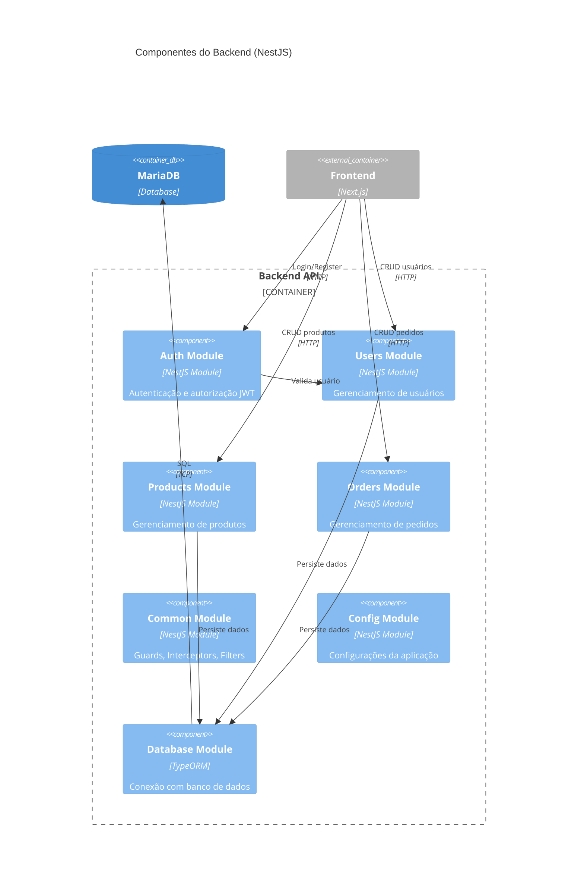

# C4 Model - Diagrama de Componentes

## Nível 3: Componentes do Backend

O diagrama de componentes detalha a estrutura interna do container Backend (NestJS),
mostrando os módulos e suas interações.

### Diagrama de Componentes - Backend



---

## Estrutura Detalhada dos Módulos

### Auth Module

```
┌──────────────────────────────────────────────────────────────┐
│                        AUTH MODULE                            │
├──────────────────────────────────────────────────────────────┤
│                                                              │
│  ┌─────────────────┐    ┌─────────────────┐                 │
│  │  AuthController │    │   AuthService   │                 │
│  │                 │───▶│                 │                 │
│  │  POST /login    │    │  validateUser() │                 │
│  │  POST /register │    │  login()        │                 │
│  │  POST /refresh  │    │  register()     │                 │
│  │  POST /logout   │    │  refreshToken() │                 │
│  └─────────────────┘    └────────┬────────┘                 │
│                                  │                           │
│         ┌────────────────────────┼────────────────────┐     │
│         ▼                        ▼                    ▼     │
│  ┌─────────────┐    ┌────────────────┐    ┌──────────────┐ │
│  │   JwtStrategy  │    │ LocalStrategy  │    │ JwtRefresh │ │
│  │             │    │              │    │   Strategy   │ │
│  └─────────────┘    └────────────────┘    └──────────────┘ │
│                                                              │
│  ┌───────────────────────────────────────────────────────┐  │
│  │                      GUARDS                            │  │
│  │  JwtAuthGuard  │  LocalAuthGuard  │  RolesGuard       │  │
│  └───────────────────────────────────────────────────────┘  │
│                                                              │
└──────────────────────────────────────────────────────────────┘
```

### Users Module

```
┌──────────────────────────────────────────────────────────────┐
│                       USERS MODULE                            │
├──────────────────────────────────────────────────────────────┤
│                                                              │
│  ┌─────────────────┐    ┌─────────────────┐                 │
│  │ UsersController │    │  UsersService   │                 │
│  │                 │───▶│                 │                 │
│  │  GET    /users  │    │  findAll()      │                 │
│  │  GET    /users/:id│   │  findOne()      │                 │
│  │  POST   /users  │    │  create()       │                 │
│  │  PUT    /users/:id│   │  update()       │                 │
│  │  DELETE /users/:id│   │  remove()       │                 │
│  └─────────────────┘    └────────┬────────┘                 │
│                                  │                           │
│                                  ▼                           │
│                      ┌─────────────────┐                    │
│                      │ UsersRepository │                    │
│                      │                 │                    │
│                      │  Custom queries │                    │
│                      │  Pagination     │                    │
│                      └────────┬────────┘                    │
│                               │                              │
│                               ▼                              │
│                      ┌─────────────────┐                    │
│                      │   User Entity   │                    │
│                      │                 │                    │
│                      │  id, name       │                    │
│                      │  email, role    │                    │
│                      │  password       │                    │
│                      └─────────────────┘                    │
│                                                              │
│  ┌───────────────────────────────────────────────────────┐  │
│  │                        DTOs                            │  │
│  │  CreateUserDto  │  UpdateUserDto  │  UserResponseDto  │  │
│  └───────────────────────────────────────────────────────┘  │
│                                                              │
└──────────────────────────────────────────────────────────────┘
```

### Common Module

```
┌──────────────────────────────────────────────────────────────┐
│                       COMMON MODULE                           │
├──────────────────────────────────────────────────────────────┤
│                                                              │
│  ┌───────────────────────────────────────────────────────┐  │
│  │                      GUARDS                            │  │
│  │                                                        │  │
│  │  ┌─────────────┐  ┌─────────────┐  ┌─────────────┐   │  │
│  │  │JwtAuthGuard │  │ RolesGuard  │  │ThrottleGuard│   │  │
│  │  └─────────────┘  └─────────────┘  └─────────────┘   │  │
│  └───────────────────────────────────────────────────────┘  │
│                                                              │
│  ┌───────────────────────────────────────────────────────┐  │
│  │                   INTERCEPTORS                         │  │
│  │                                                        │  │
│  │  ┌─────────────┐  ┌─────────────┐  ┌─────────────┐   │  │
│  │  │  Transform  │  │  Logging    │  │  Timeout    │   │  │
│  │  │ Interceptor │  │ Interceptor │  │ Interceptor │   │  │
│  │  └─────────────┘  └─────────────┘  └─────────────┘   │  │
│  └───────────────────────────────────────────────────────┘  │
│                                                              │
│  ┌───────────────────────────────────────────────────────┐  │
│  │                     FILTERS                            │  │
│  │                                                        │  │
│  │  ┌─────────────────┐  ┌──────────────────────────┐   │  │
│  │  │HttpExceptionFilter│  │AllExceptionsFilter     │   │  │
│  │  └─────────────────┘  └──────────────────────────┘   │  │
│  └───────────────────────────────────────────────────────┘  │
│                                                              │
│  ┌───────────────────────────────────────────────────────┐  │
│  │                    DECORATORS                          │  │
│  │                                                        │  │
│  │  @CurrentUser()  │  @Roles()  │  @Public()            │  │
│  └───────────────────────────────────────────────────────┘  │
│                                                              │
│  ┌───────────────────────────────────────────────────────┐  │
│  │                      PIPES                             │  │
│  │                                                        │  │
│  │  ValidationPipe  │  ParseUUIDPipe  │  ParseIntPipe    │  │
│  └───────────────────────────────────────────────────────┘  │
│                                                              │
└──────────────────────────────────────────────────────────────┘
```

---

## Fluxo de uma Requisição

```
┌─────────┐     ┌───────────┐     ┌────────┐     ┌─────────┐     ┌──────────┐
│ Request │────▶│  Guards   │────▶│  Pipes │────▶│Controller│────▶│ Service  │
└─────────┘     └───────────┘     └────────┘     └─────────┘     └────┬─────┘
                                                                      │
                ┌───────────┐     ┌────────┐     ┌─────────┐          │
                │ Response  │◀────│Intercept│◀────│ Filters │◀─────────┘
                └───────────┘     └────────┘     └─────────┘

1. Guards: Verifica autenticação/autorização
2. Pipes: Valida e transforma dados de entrada
3. Controller: Recebe request, delega para service
4. Service: Executa lógica de negócio
5. Filters: Captura e trata exceções
6. Interceptors: Transforma response
```

---

## Próximo Documento

→ [Data Flow](./data-flow.md) - Diagramas de fluxo de dados
