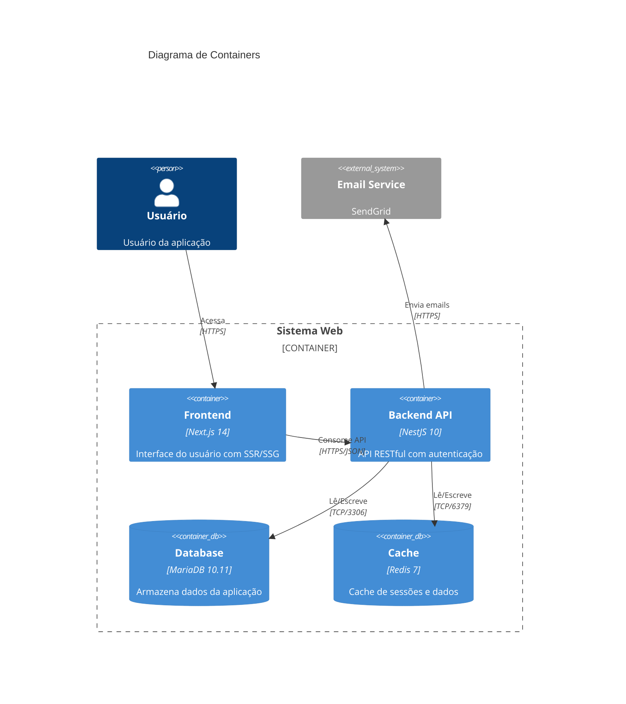

# C4 Model - Diagrama de Containers

## Nível 2: Containers do Sistema

O diagrama de containers mostra a arquitetura de alto nível do sistema,
apresentando os containers (aplicações, stores de dados) e suas interações.

### Diagrama



### Descrição dos Containers

| Container | Tecnologia | Descrição | Porta |
|-----------|------------|-----------|-------|
| Frontend | Next.js 14 | SPA com SSR, React 18, TailwindCSS | 3000 |
| Backend API | NestJS 10 | API REST, JWT Auth, Swagger | 3001 |
| Database | MariaDB 10.11 | Banco relacional principal | 3306 |
| Cache | Redis 7 | Cache de sessões e dados | 6379 |

---

## Diagrama Detalhado (ASCII)

```
┌─────────────────────────────────────────────────────────────────────────┐
│                              SISTEMA WEB                                 │
├─────────────────────────────────────────────────────────────────────────┤
│                                                                         │
│  ┌─────────────────────────────────────────────────────────────────┐   │
│  │                         FRONTEND (Next.js)                       │   │
│  │                                                                  │   │
│  │  ┌──────────────┐  ┌──────────────┐  ┌──────────────────────┐  │   │
│  │  │  App Router  │  │  Components  │  │     Stores          │  │   │
│  │  │  (Pages)     │  │  (React)     │  │  (Zustand + Query)  │  │   │
│  │  └──────────────┘  └──────────────┘  └──────────────────────┘  │   │
│  │                                                                  │   │
│  │  ┌──────────────┐  ┌──────────────┐  ┌──────────────────────┐  │   │
│  │  │   Services   │  │    Hooks     │  │     TailwindCSS     │  │   │
│  │  │   (Axios)    │  │  (Custom)    │  │     (Styles)        │  │   │
│  │  └──────────────┘  └──────────────┘  └──────────────────────┘  │   │
│  │                                                                  │   │
│  └────────────────────────────┬────────────────────────────────────┘   │
│                               │                                         │
│                               │ HTTP/JSON                               │
│                               ▼                                         │
│  ┌─────────────────────────────────────────────────────────────────┐   │
│  │                         BACKEND (NestJS)                         │   │
│  │                                                                  │   │
│  │  ┌──────────────┐  ┌──────────────┐  ┌──────────────────────┐  │   │
│  │  │ Controllers  │  │   Services   │  │    Repositories     │  │   │
│  │  │  (Routes)    │  │  (Business)  │  │    (Data Access)    │  │   │
│  │  └──────────────┘  └──────────────┘  └──────────────────────┘  │   │
│  │                                                                  │   │
│  │  ┌──────────────┐  ┌──────────────┐  ┌──────────────────────┐  │   │
│  │  │   Guards     │  │ Interceptors │  │       DTOs          │  │   │
│  │  │  (Auth)      │  │  (Logging)   │  │   (Validation)      │  │   │
│  │  └──────────────┘  └──────────────┘  └──────────────────────┘  │   │
│  │                                                                  │   │
│  └────────────────┬─────────────────────────────┬──────────────────┘   │
│                   │                             │                       │
│                   │ TCP/3306                    │ TCP/6379              │
│                   ▼                             ▼                       │
│  ┌────────────────────────────┐   ┌────────────────────────────┐       │
│  │        MariaDB             │   │          Redis             │       │
│  │                            │   │                            │       │
│  │  • Dados de usuários       │   │  • Cache de sessões        │       │
│  │  • Dados de negócio        │   │  • Cache de queries        │       │
│  │  • Logs de auditoria       │   │  • Rate limiting           │       │
│  │                            │   │                            │       │
│  └────────────────────────────┘   └────────────────────────────┘       │
│                                                                         │
└─────────────────────────────────────────────────────────────────────────┘
```

---

## Comunicação Entre Containers

### Frontend → Backend

```
┌──────────────┐                      ┌──────────────┐
│   Frontend   │  ────HTTP/JSON────▶  │   Backend    │
│   (Next.js)  │                      │   (NestJS)   │
│              │  ◀────HTTP/JSON────  │              │
└──────────────┘                      └──────────────┘

Protocolo: HTTPS
Formato: JSON
Autenticação: Bearer Token (JWT)
Endpoints: /api/v1/*
```

### Backend → Database

```
┌──────────────┐                      ┌──────────────┐
│   Backend    │  ────TCP/SQL──────▶  │   MariaDB    │
│   (NestJS)   │                      │              │
│              │  ◀────ResultSet────  │              │
└──────────────┘                      └──────────────┘

Driver: mysql2
ORM: TypeORM
Pool: 10 conexões
Port: 3306
```

### Backend → Cache

```
┌──────────────┐                      ┌──────────────┐
│   Backend    │  ────TCP/Redis────▶  │    Redis     │
│   (NestJS)   │                      │              │
│              │  ◀────Response─────  │              │
└──────────────┘                      └──────────────┘

Driver: ioredis
Port: 6379
TTL padrão: 1 hora
```

---

## Próximo Nível

→ [C4 Component](./c4-component.md) - Detalhamento dos componentes internos
