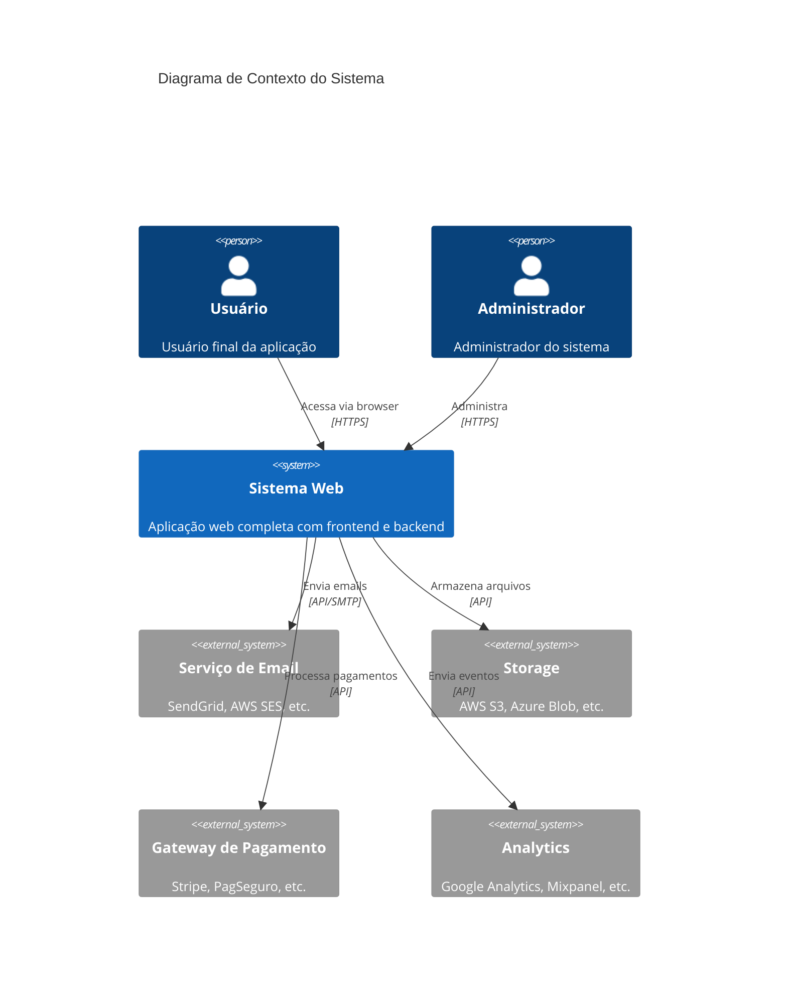

# C4 Model - Diagrama de Contexto

## Nível 1: Contexto do Sistema

O diagrama de contexto mostra o sistema em seu mais alto nível de abstração,
apresentando como ele se relaciona com usuários e sistemas externos.

### Diagrama



### Descrição dos Elementos

| Elemento | Tipo | Descrição |
|----------|------|-----------|
| Usuário | Pessoa | Usuário final que acessa a aplicação web |
| Administrador | Pessoa | Responsável por gerenciar o sistema |
| Sistema Web | Sistema | A aplicação sendo desenvolvida |
| Serviço de Email | Sistema Externo | Envio de emails transacionais |
| Storage | Sistema Externo | Armazenamento de arquivos (imagens, docs) |
| Gateway de Pagamento | Sistema Externo | Processamento de transações financeiras |
| Analytics | Sistema Externo | Coleta de métricas e eventos |

### Fluxos Principais

1. **Usuário → Sistema**: Acesso web via HTTPS
2. **Sistema → Email**: Notificações, confirmações, recuperação de senha
3. **Sistema → Storage**: Upload/download de arquivos
4. **Sistema → Payment**: Cobrança de assinaturas/produtos
5. **Sistema → Analytics**: Eventos de uso para análise

---

## Versão ASCII (alternativa)

```
┌─────────────────────────────────────────────────────────────────┐
│                        AMBIENTE EXTERNO                          │
├─────────────────────────────────────────────────────────────────┤
│                                                                 │
│    ┌─────────┐                              ┌─────────────┐    │
│    │ Usuário │                              │   Admin     │    │
│    └────┬────┘                              └──────┬──────┘    │
│         │                                          │           │
│         │ HTTPS                             HTTPS  │           │
│         │                                          │           │
│         ▼                                          ▼           │
│    ┌─────────────────────────────────────────────────────┐    │
│    │                                                     │    │
│    │                   SISTEMA WEB                       │    │
│    │                                                     │    │
│    │              (Next.js + NestJS)                     │    │
│    │                                                     │    │
│    └──────┬──────────────┬──────────────┬───────────────┘    │
│           │              │              │                     │
│           ▼              ▼              ▼                     │
│    ┌──────────┐   ┌──────────┐   ┌──────────┐                │
│    │  Email   │   │ Storage  │   │ Payment  │                │
│    │ Service  │   │  (S3)    │   │ Gateway  │                │
│    └──────────┘   └──────────┘   └──────────┘                │
│                                                               │
└───────────────────────────────────────────────────────────────┘
```

---

## Próximo Nível

→ [C4 Container](./c4-container.md) - Detalhamento dos containers do sistema
