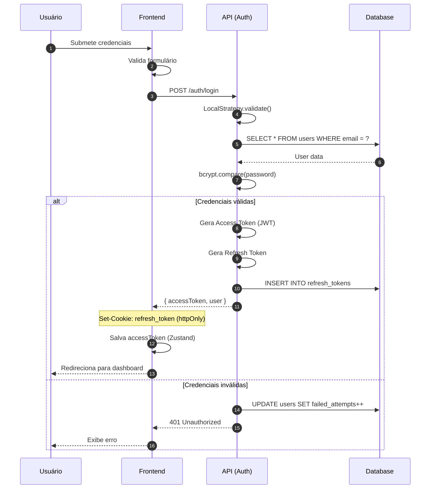
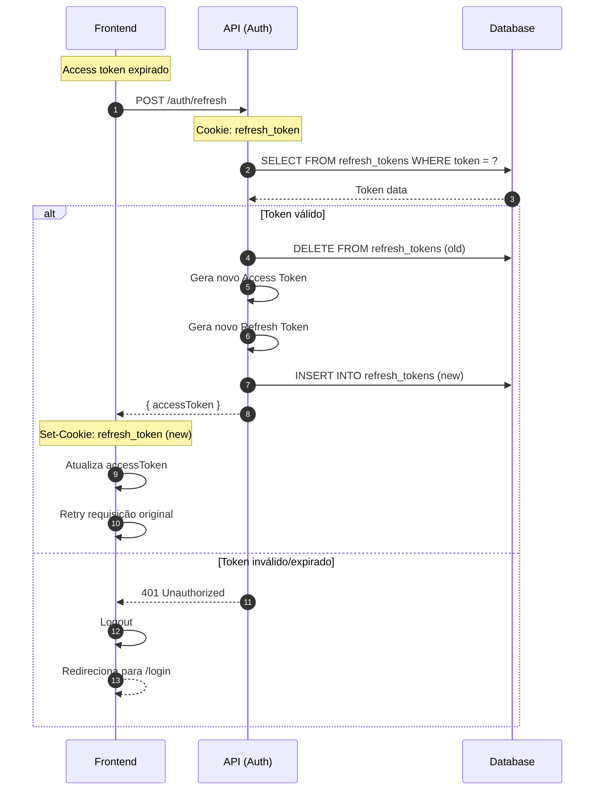
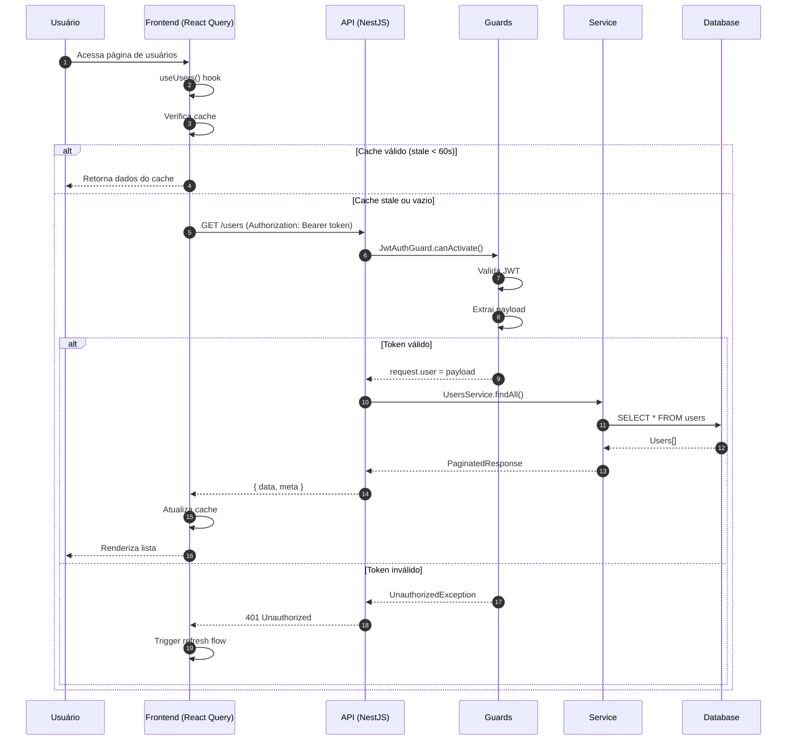

# Diagramas de Fluxo de Dados

## 1. Fluxo de Autenticação

### 1.1 Login Flow



### 1.2 Refresh Token Flow



---

## 2. Fluxo de Request Autenticado



---

## 3. Fluxo de Criação (CRUD)

```mermaid
sequenceDiagram
    autonumber
    participant U as Usuário
    participant F as Frontend
    participant M as Mutation (React Query)
    participant A as API
    participant V as Validation Pipe
    participant S as Service
    participant DB as Database

    U->>F: Preenche formulário
    U->>F: Clica "Salvar"

    F->>F: Validação client-side (Zod)

    alt Validação OK
        F->>M: useMutation.mutate(data)
        M->>A: POST /users

        A->>V: ValidationPipe.transform()
        V->>V: class-validator.validate()

        alt DTO válido
            A->>S: UsersService.create()

            S->>DB: SELECT WHERE email = ?
            DB-->>S: null (email disponível)

            S->>S: bcrypt.hash(password)
            S->>DB: INSERT INTO users

            DB-->>S: Created user
            S-->>A: UserResponseDto
            A-->>M: 201 Created

            M->>M: onSuccess callback
            M->>M: queryClient.invalidateQueries(['users'])
            M-->>F: Sucesso

            F-->>U: Toast "Usuário criado"
            F->>F: Redireciona para lista

        else Email já existe
            S-->>A: ConflictException
            A-->>M: 409 Conflict
            M-->>F: Erro
            F-->>U: Exibe erro "Email já existe"
        end

    else DTO inválido
        V-->>A: BadRequestException
        A-->>M: 400 Bad Request
        M-->>F: Erro de validação
        F-->>U: Exibe erros nos campos
    end

    else Validação falhou
        F-->>U: Exibe erros nos campos
    end
```

---

## 4. Fluxo de Estado (Zustand + React Query)

```
┌─────────────────────────────────────────────────────────────────────┐
│                         FRONTEND                                     │
├─────────────────────────────────────────────────────────────────────┤
│                                                                     │
│  ┌─────────────────────────────────────────────────────────────┐   │
│  │                      COMPONENTE                              │   │
│  │                                                              │   │
│  │   const { user } = useAuthStore()        // Zustand          │   │
│  │   const { data: users } = useUsers()     // React Query      │   │
│  │                                                              │   │
│  └──────────────────┬─────────────────────────┬────────────────┘   │
│                     │                         │                     │
│         ┌───────────▼───────────┐  ┌─────────▼──────────────┐      │
│         │      ZUSTAND          │  │     REACT QUERY        │      │
│         │   (Client State)      │  │    (Server State)      │      │
│         │                       │  │                        │      │
│         │  • UI State           │  │  • Cache automático    │      │
│         │  • Auth State         │  │  • Background refetch  │      │
│         │  • Preferences        │  │  • Stale-while-revalid │      │
│         │                       │  │  • Optimistic updates  │      │
│         │  localStorage ◀──────┐│  │                        │      │
│         │  (persist)           ││  │  ┌──────────────────┐  │      │
│         └──────────────────────┘│  │  │   Query Cache    │  │      │
│                                 │  │  │                  │  │      │
│                                 │  │  │  ['users'] ──────┼──┼──────│
│                                 │  │  │  ['user', id]    │  │      │
│                                 │  │  │  ['products']    │  │      │
│                                 │  │  └──────────────────┘  │      │
│                                 │  │           │            │      │
│                                 │  └───────────┼────────────┘      │
│                                 │              │                    │
│                                 │              ▼                    │
│                                 │     ┌───────────────┐             │
│                                 │     │    Service    │             │
│                                 │     │    (Axios)    │             │
│                                 │     └───────┬───────┘             │
│                                 │             │                     │
└─────────────────────────────────┼─────────────┼─────────────────────┘
                                  │             │
                                  │             │ HTTP
                                  │             ▼
                                  │     ┌───────────────┐
                                  │     │    BACKEND    │
                                  │     │    (API)      │
                                  │     └───────────────┘
                                  │
                                  │ Token para requests
                                  └──────────────────────
```

---

## 5. Fluxo de Dados - Visão Geral

```
┌─────────────────────────────────────────────────────────────────────┐
│                           BROWSER                                    │
├─────────────────────────────────────────────────────────────────────┤
│                                                                     │
│    ┌──────────────┐                                                 │
│    │   Usuário    │                                                 │
│    └──────┬───────┘                                                 │
│           │ Interação                                               │
│           ▼                                                         │
│    ┌──────────────────────────────────────────────────────────┐    │
│    │                    Next.js (React)                        │    │
│    │  ┌─────────┐  ┌─────────┐  ┌─────────┐  ┌─────────┐     │    │
│    │  │ Pages   │  │Components│  │  Hooks  │  │ Stores  │     │    │
│    │  └────┬────┘  └────┬────┘  └────┬────┘  └────┬────┘     │    │
│    │       │            │            │            │           │    │
│    │       └────────────┴─────┬──────┴────────────┘           │    │
│    │                          │                                │    │
│    │                   ┌──────▼──────┐                        │    │
│    │                   │   Services  │                        │    │
│    │                   │   (Axios)   │                        │    │
│    │                   └──────┬──────┘                        │    │
│    └──────────────────────────┼────────────────────────────────┘    │
│                               │                                     │
└───────────────────────────────┼─────────────────────────────────────┘
                                │ HTTPS/JSON
                                ▼
┌───────────────────────────────────────────────────────────────────────┐
│                              SERVER                                    │
├───────────────────────────────────────────────────────────────────────┤
│                                                                       │
│    ┌────────────────────────────────────────────────────────────┐    │
│    │                       NestJS API                            │    │
│    │                                                             │    │
│    │    Request ──▶ Guard ──▶ Pipe ──▶ Controller ──▶ Service   │    │
│    │                                                     │       │    │
│    │    Response ◀── Interceptor ◀── Filter ◀────────────┘       │    │
│    │                                                             │    │
│    └───────────────────────────┬─────────────────────────────────┘    │
│                                │                                      │
│              ┌─────────────────┼─────────────────┐                   │
│              │                 │                 │                   │
│              ▼                 ▼                 ▼                   │
│    ┌──────────────┐   ┌──────────────┐   ┌──────────────┐           │
│    │   MariaDB    │   │    Redis     │   │   External   │           │
│    │  (Primary)   │   │   (Cache)    │   │   Services   │           │
│    └──────────────┘   └──────────────┘   └──────────────┘           │
│                                                                       │
└───────────────────────────────────────────────────────────────────────┘
```

---

## 6. Legenda dos Diagramas

| Símbolo | Significado |
|---------|-------------|
| `──▶` | Fluxo de dados unidirecional |
| `◀──▶` | Fluxo de dados bidirecional |
| `─ ─ ─▶` | Fluxo opcional/condicional |
| `┌──┐` | Container/Componente |
| `[  ]` | Processo/Ação |
| `( )` | Ator/Entidade externa |

---

## Referências

- [C4 Model](https://c4model.com/)
- [Mermaid Diagrams](https://mermaid.js.org/)
- [Sequence Diagrams](https://www.uml-diagrams.org/sequence-diagrams.html)
